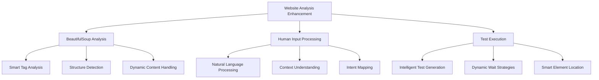

# Web Automation Testing Enhancement Plan

## Overview

This document outlines the plan for enhancing three critical components of the web automation testing framework:
1. BeautifulSoup Analysis
2. Human Input Processing
3. Test Execution



## 1. BeautifulSoup Analysis Enhancement

### Current State:
- Basic tag counting and form analysis
- Simple structure detection
- Limited dynamic content analysis

### Proposed Improvements:

#### a) Smart Tag Analysis:
```python
- Implement pattern recognition for common web components
- Add semantic structure analysis
- Enhanced attribute analysis for better element identification
```

#### b) Structure Detection:
```python
- Add layout pattern recognition
- Implement component relationship mapping
- Enhanced selector generation based on DOM hierarchy
```

#### c) Dynamic Content Handling:
```python
- Implement AJAX request monitoring
- Add WebSocket content tracking
- Enhanced infinite scroll detection
```

## 2. Human Input Processing

### Current State:
- Basic command parsing
- Limited context understanding
- Simple selector mapping

### Proposed Improvements:

#### a) Natural Language Processing:
```python
- Add intent classification
- Implement entity recognition for web elements
- Add fuzzy matching for element identification
```

#### b) Context Understanding:
```python
- Implement context state tracking
- Add page state awareness
- Enhanced error message generation
```

#### c) Intent Mapping:
```python
- Add action inference from natural language
- Implement smart selector generation
- Add test step generation from natural language
```

## 3. Test Execution Enhancement

### Current State:
- Basic wait strategies
- Simple element location
- Limited error handling

### Proposed Improvements:

#### a) Intelligent Test Generation:
```python
- Add dynamic test case generation
- Implement smart validation strategies
- Enhanced error recovery mechanisms
```

#### b) Dynamic Wait Strategies:
```python
- Implement adaptive wait times
- Add element state prediction
- Enhanced loading detection
```

#### c) Smart Element Location:
```python
- Add AI-powered element identification
- Implement backup location strategies
- Enhanced selector chain generation
```

## Implementation Timeline

### Phase 1 - Core Enhancements (2 weeks)
- Enhance BeautifulSoup analysis capabilities
- Improve basic element detection mechanisms
- Add smart wait strategies

### Phase 2 - Intelligence Layer (2 weeks)
- Implement NLP components
- Add context awareness
- Enhance test generation capabilities

### Phase 3 - Integration & Optimization (1 week)
- Integrate all components
- Optimize performance
- Add error recovery mechanisms

## Success Metrics
- Improved element detection accuracy (target: 95%)
- Reduced test flakiness (target: <5%)
- Better human input understanding (target: 90% accuracy)
- Faster test execution (target: 30% reduction in execution time)